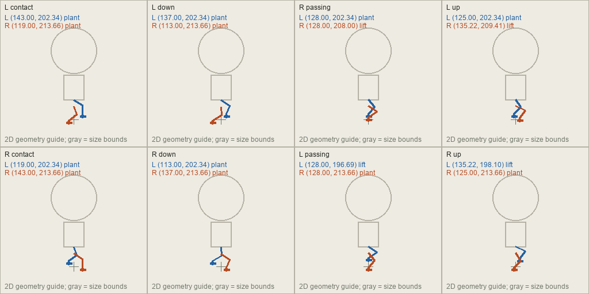

# Guarin locomotion repair

Decision at commit `1e34ed9`, 2026-10-05: define and verify precise foot targets before requesting new walking or idle drawings. Confidence: 99%, based on the user's explicit instruction. This stage specifies authoring geometry; it does not replace source artwork, change the running motion lab, or modify an endpoint contract.

## Current failures

The user reports these motion defects. The parent inspected all 96 existing idle/walk poses in the diagnostic contact sheets below; static inspection cannot independently prove the direction of motion.

| Facing | Walk feedback | Idle feedback |
|---|---|---|
| N | Cardinal gait also fails. | Stumbles and shifts feet. |
| NE | Skipping, jagged motion. | Needs the same fixed-foot standard. |
| E | Cardinal gait also fails. | Stumbles and shifts feet. |
| SE | Glides without convincing steps. | Needs the same fixed-foot standard. |
| S | Cardinal gait also fails. | Best existing idle; make the nod subtler. |
| SW | Sideways leg motion reads as dancing. | Needs the same fixed-foot standard. |
| W | Cardinal gait also fails. | Trembling; make sway gentle. |
| NW | Feet imply backward travel. | Needs the same fixed-foot standard. |

[Current idle](current-idle.png) and [current walk](current-walk.png) use the existing viewer's approximate pivots and 160-pixel standing scale. A red cross marks the estimated root, not an annotated sole. Original image bytes are unchanged. North idle visibly changes boot positions. Other views change cloth, gear and helmet texture, so foot alignment alone will not remove all flicker.

The original prompts specify six walking poses by prose, combine down/passing poses, and provide no numerical contacts. The importer estimates column anchors from silhouette bounds and row baselines from median figure bottoms. It does not locate anatomical feet. These estimates cannot establish gait correctness.

The motion lab advances at 140 ground pixels per second independently of character size, playback speed and clip rate. The current 750-millisecond walk therefore travels 105 ground pixels per cycle at normal settings. There is no authored stride to compare against that distance. Passing timing and transparency tests does not validate walking.

## Repair status

- [x] Preserve and inspect current source poses; record every reported failure.
- [x] Define numerical contacts, lift, stride, projection, timing and idle invariants.
- [x] Verify all directional targets and continuous planted-foot trajectories.
- [x] Provide diagrams and a complete frame table before generation: 456 records and 40 guide sheets.
- [x] Verify start/stop endpoints, planted supports, travel speed and held-frame drift.
- [ ] Verify direction changes and responsive input handoffs before runtime integration.
- [ ] Generate and measure a small pilot against the targets before a full replacement batch.
- [ ] Replace only approved locomotion sources; retain other action families.

## Authoring contract

Decision at commit `d615d25`: use a short 48-unit full stride, an 800-millisecond cycle, and 24 walk drawings at a 160-pixel standing reference height. Confidence: 90% as a mathematically checked starting calibration for squat legs. The feel, costume and finished drawing quality still need visual checks. These are project choices, not universal animation rules.

The [numerical plan](foot-targets.json) is authoritative. The [frame table](foot-targets.csv) gives every frame's time, support status and foot coordinates. [foot_plan.py](foot_plan.py) computes the geometry; [export_plan.py](export_plan.py) exports targets and drawing guides. The existing sprite importer and viewer do not consume this plan yet.

| Quantity | Fixed value |
|---|---|
| Logical frame | 256 × 256 pixels |
| Neutral standing height | 160 pixels; never rescale individual poses |
| Ground root in each frame | (128, 208); independent of either foot |
| Camera elevation | 45 degrees, fixed orthographic projection |
| Full left-to-left stride | 48 ground units; each alternating step advances 24 |
| Loop duration | 800 milliseconds |
| Walk drawings | 24, with 33⅓-millisecond holds: 30 frames per second |
| Travel at reference scale | 60 ground units per second |
| Left/right foot lanes | −8 / +8 units from the centre line |
| Sole forward range | −15 to +15 units |
| Maximum boot lift | 8 height units; about 5.66 screen pixels |
| Support time per foot | 62.5% of the cycle; both feet overlap in support |
| Hip height | 40 ± 1 height units during walk; fixed at 40 during idle |
| Upper/lower leg lengths | 21 units each; solve the knee from the foot target |
| Idle loop | Six 400-millisecond holds; 2.4 seconds total |
| Idle head motion | At most ±0.5 screen pixel; hips, knees and feet fixed |

All units use the same reference scale. Height is a projection coordinate, not permission to produce rendered 3D art. The guides and final character drawings are 2D. Gray head/body bounds in the guides indicate size only; exact S13 determines the character design.

## How each foot is placed

Use anatomical left and right throughout. The sword remains in the right hand; the shield remains on the left arm. Never mirror the art to create another direction.

Let `p` be elapsed cycle time divided by 800 milliseconds. Left-foot phase is `p mod 1`; right-foot phase is `(p + 0.5) mod 1`. Local `u` is forward, `l` is sideways, and `h` is height. Set `l = −8` for the left sole and `+8` for the right sole in every walking frame. A sole means the centre of the boot's underside directly below its ankle. Heel and toe are four units behind and six units ahead of it. Keep these dimensions and the boot's forward heading constant; this first repair uses a flat planted sole rather than a heel/toe roll.

For foot phase `q` from 0 through 0.625, the sole is planted: `u = 15 − 48q`, `h = 0`. The character root advances by `48p`. Their sum is constant through that foot's support interval. A planted boot therefore moves backward relative to the body while remaining on the same ground mark. The lifted boot advances toward its next contact. Reversing a row until it looks plausible is not a valid repair.

For the remaining phase, set `s = (q − 0.625) / 0.375`, then `u = −15 + 30s²(3 − 2s)` and `h = 8 sin²(πs)`. This gives a forward swing with a visible lift and smooth endpoints. The right foot follows the identical path half a cycle later. At least one foot always supports the character. Knees bend toward the heading and retain their two 21-unit bone lengths; neither leg may wander into a sideways arc.

The eight important poses below define the motion. The 24 production drawings sample the complete curve, including positions between these keys.

| Time | Pose | Left sole (forward, lift) | Right sole (forward, lift) |
|---:|---|---|---|
| 0 ms | Left contact | (15, 0), planted | (−9, 0), planted |
| 100 ms | Down / right toe-off | (9, 0), planted | (−15, 0), leaving ground |
| 250 ms | Right passes left | (0, 0), planted | (0, 8), lifted |
| 300 ms | Up / right approaches contact | (−3, 0), planted | (7.222222, 6), lifted |
| 400 ms | Right contact | (−9, 0), planted | (15, 0), planted |
| 500 ms | Down / left toe-off | (−15, 0), leaving ground | (9, 0), planted |
| 650 ms | Left passes right | (0, 8), lifted | (0, 0), planted |
| 700 ms | Up / left approaches contact | (7.222222, 6), lifted | (−3, 0), planted |

At 800 milliseconds, the curve reaches the next left contact. Do not add that endpoint as a duplicate loop frame.



## Projection into all eight directions

The compass follows the user's convention: north is up. Let `(dx, dy)` be the normalized ground heading: N `(0, −1)`, NE `(1, −1)/√2`, E `(1, 0)`, SE `(1, 1)/√2`, S `(0, 1)`, SW `(−1, 1)/√2`, W `(−1, 0)`, NW `(−1, −1)/√2`. Diagonal movement is normalized before projection, matching the lab's existing ground guide.

Project every landmark with the same equations:

```text
groundX = dx × u − dy × l
groundY = dy × u + dx × l
frameX = 128 + groundX
frameY = 208 + sin(45°) × groundY − cos(45°) × h
```

This determines direction and foreshortening numerically. The image generator must not invent separate diagonal gaits. Guides are available for [NW](guides/nw-walk.png), [NE](guides/ne-walk.png), [SE](guides/se-walk.png), [SW](guides/sw-walk.png), [N](guides/n-walk.png), [E](guides/e-walk.png), [S](guides/s-walk.png) and [W](guides/w-walk.png). The same folder includes idle, start and both stopping guides for each direction.

## Idle and transition rules

Idle uses `u = 0`, `h = 0`, and fixed foot lanes. Every sole, heel, toe, ankle, knee and hip target is identical in all six idle frames. Only the upper chest, head and attached cloth may breathe. The head offset is `0.5 sin(2πp)` screen pixel. No heel lift, changing knee bend, boot shuffle, random lean or redrawn material pattern may masquerade as breathing. Head size stays fixed.

Starting takes 300 milliseconds. The right sole stays at its initial world contact while the left boot advances 24 units and lifts. With transition fraction `s`, root advance is `9s²`, left world advance is `24s²(3 − 2s)`, and left lift is `8 sin²(πs)`. The endpoint exactly matches left-contact walking geometry, with the root travelling at 60 units per second.

Stopping samples begin at left or right contact. The leading sole stays at its world point, 15 units ahead of the starting root. The trailing boot advances from −9 to +15 world units with the same smooth step/lift function. The root moves at 60 units per second for 200 milliseconds, then brakes to zero over 100 milliseconds, advancing 15 units in total. Both feet finish at neutral idle targets. Nine midpoint drawings cover each start/stop sequence; the terminal endpoint hands off without an extra hold.

These transition samples establish consistent contact geometry. They do not authorize delaying gameplay input until a contact pose. Responsive stopping at an arbitrary gait phase needs a phase-aware settle before runtime integration. Turning also needs a preserved world contact: retain the supporting sole through the turn, calculate its coordinates under the new heading, then place the next swing foot along that heading. Merely retaining frame number or flipping a sprite does not lock a planted foot. Turn and action handoff drawings are not part of the 456 exported frames.

## Travel and frame timing

For standing preview height `H`, playback multiplier `m`, and clip-rate multiplier `r`, planned ground speed is `60 × H/160 × m × r`. Project its vertical component with the same 45-degree factor. Scale stride, leg dimensions and root offsets together. Changing animation speed must also change travel; changing preview size must not change the stride-to-body ratio. This is an authoring calibration, not a change to game movement rules.

Raster frames are held while the root moves continuously. That prevents perfect foot locking at every display instant. Each drawing uses the midpoint of its hold, so a two-unit advance per walk drawing produces at most one unit of ideal contact drift either side of the target. All exported walk/start/stop holds meet this bound at reference scale. Eight drawings at this stride would allow approximately three units of drift either side; increasing frames addresses a measured limit rather than adding arbitrary detail. Do not crossfade drawn poses to hide errors.

## Image-generation handoff

1. Begin with a small pilot: NW walking and W idle. Use a fresh raw prompt for each, one facing and one family per call.
2. Include exact original G15 and S13 as palette/identity inputs, plus the matching new numerical guide as pose control. Never include failed sprites, the current diagnostic contact sheets, or an earlier failed repair.
3. Put the actual frame table into the prompt: frame number, time, left/right sole, heel/toe, lift and planted status. A file path alone does not give the model those values. State the fixed root and logical canvas explicitly.
4. Require flat drawn 2D, exact huge-head/squat-body costume, fixed camera and anatomical gear. For NW, require the rear helmet/cape, no front visor. For W, retain profile orientation. Guide colors, labels and gray bounds must not appear in the final art.
5. Request only those poses in the guide layout. Walk uses six columns × four rows; idle uses three × two. Use real transparent backgrounds and preserve the raw outputs.
6. Register the complete page to the declared logical cells with one uniform scale if the service returns a different resolution. Do not shift or scale each figure by its silhouette, feet midpoint or helmet bounds. Trimmed export must retain pivot `(128 − trimLeft, 208 − trimTop)`.
7. Annotate each visible boot's sole, heel, toe and anatomical identity in the actual output. Measure against the exported targets. Occluded landmarks remain unverified; an image hash or alpha box is not a foot measurement.
8. Play the result over ground marks with calibrated root travel at normal and quarter speed, inspect the loop seam and reduced scale, then test input handoffs. Advance to other directions only after the pilot passes.

## Acceptance checks

- Sole/heel/toe landmark error no more than one reference pixel from the numerical targets, after whole-page registration. No per-frame geometry correction can conceal a miss.
- Planted boot remains within two reference pixels of its world mark during held raster playback: at most one from drawing error plus one from temporal holding. A lifted boot must visibly clear the ground and travel forward. Foot lanes stay fixed.
- Idle lower-body placement is identical, with no visible boot/knee or material jitter. Upper-body motion stays within the stated small range; helmet shape and texture do not change randomly.
- Stable scale, short limbs, fixed camera, consistent occlusion and gear. Check cloth and sword/shield flicker separately from feet.
- Final-to-first walk transition has the normal next-step spacing, with no repeated endpoint. Start/stop endpoints match their destination stance. Turns, strike recovery and damage interruptions receive separate contact checks before integration.
- Reject a failed measured pilot; do not relabel it as correct because generation completed. If fresh controlled draws repeatedly miss the geometry, use painted 2D parts on a controlled rig or hand-correct the poses before export. Prompt precision cannot guarantee pixel precision from a free-form image model.

Fifteen deterministic tests verify world contact through two cycles, all eight projections, continuous support, fixed lanes, nonnegative lift, equal leg lengths, idle immobility, transition contacts/speeds and held-frame drift. All 456 exported records and 40 guide dimensions were checked. These checks establish the plan; they do not certify artwork that has not been generated.

Run `uv run --no-project --with pytest python -m pytest art/sprites/guarin/locomotion/test_foot_plan.py -q` from the project root. Export with Python plus Pillow, as used by the existing sprite importer. The original source hashes are checked before guide export.

## Primary references

[Animation Mentor's walk tutorial](https://www.animationmentor.com/blog/tutorial-animating-human-walk-cycle/) describes contact, down, passing and up poses, followed by root translation. That supports the pose-first workflow; the squat proportions and numerical stride here are project choices. [Godot SpriteFrames](https://docs.godotengine.org/en/stable/classes/class_spriteframes.html) defines frame duration using relative duration, animation rate and playing speed. Our contact/travel equation must use that same elapsed animation time.
